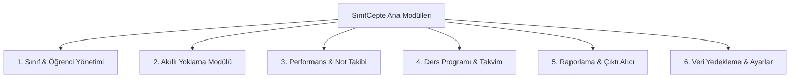

# 📄 SınıfCepte - Ürün Gereksinim Dokümanı (PRD)

---

## 1. 🎯 Giriş ve Ürün Vizyonu

### 1.1 Ürün Tanımı
**SınıfCepte**, öğretmenlerin günlük sınıf yönetimi, hızlı yoklama alma, performans & ödev takibi yapma, ders programı düzenleme ve resmi rapor (Excel/PDF) üretme süreçlerini cep telefonları ve tabletler üzerinden 10 kat daha hızlı ve estetik bir şekilde yapmalarını sağlayan **ultra-modern bir dijital asistandır**.

### 1.2 Problemler & Çözümler
- **Problem 1**: Kağıt kalemle yoklama almak zaman kaybettirir ve veriler kaybolabilir.
  - **Çözüm**: Tek dokunuş veya kaydırma (swipe) hareketiyle saniyeler içinde Var/Geldi 🟢, Geç/İzinli 🟡, Yok/Gelmedi 🔴 kaydı alma.
- **Problem 2**: e-Okul veya idareye yoklama ve not aktarımı karmaşıktır.
  - **Çözüm**: Excel ve PDF formatlarında e-Okul uyumlu tek tıkla rapor çıktıları.
- **Problem 3**: İnternetsiz okullarda bulut tabanlı uygulamalar çalışmaz.
  - **Çözüm**: %100 Offline-First mimarisi. Veriler SQLite yerel veritabanında saklanır, internet gerektirmez.
- **Problem 4**: Eski ve demode kullanıcı arayüzleri öğretmenlerin işini zorlaştırır.
  - **Çözüm**: Glassmorphism (Cam efektli), akıcı animasyonlu, göz yormayan Dark & Light Mode destekli **UI-UX-MAX** tasarım dili.

---

## 2. 👥 Hedef Kitle ve Kullanıcı Senaryoları (Personas)

- **Ahmet Öğretmen (Lise Matematik Öğretmeni)**: 10 farklı sınıfa giriyor. Her ders başlangıcında 1 dakikadan az sürede yoklama almak ve ödev yapmayan öğrencileri tek tıkla işaretlemek istiyor.
- **Ayşe Öğretmen (İlkokul Sınıf Öğretmeni)**: Kendi sınıfının günlük katılımını, veli iletişim bilgilerini ve öğrenci performans puanlarını takip etmek istiyor. Dönem sonunda liste çıktısı alıyor.

---

## 3. 🧩 Ana Modüller ve Özellik Detayları

### Modül 1: Sınıf & Öğrenci Yönetimi
- Sınıf oluşturma, şube belirleme, ders adı tanımlama.
- Excel dosyasından (`.xlsx`, `.xls`) toplu öğrenci aktarımı.
- Öğrenci profili: Okul No, Ad Soyad, Veli Telefonu, Özel Notlar, Fotoğraf (Opsiyonel).

### Modül 2: Akıllı Yoklama Modülü
- Tarih ve ders saati seçimi.
- Liste / Kart görünümünde hızlı durum değiştirici:
  - 🟢 **Geldi (Present)**
  - 🔴 **Gelmedi (Absent)**
  - 🟡 **Geç (Late)**
  - 🔵 **İzinli (Excused)**
- Geçmiş yoklamaları görüntüleme, düzenleme ve istatistik özeti (% yoklama oranı).

### Modül 3: Performans & Not Takibi
- Sözlü / Performans puanı verme.
- Ödev kontrolü (Yapıldı / Yapılmadı / Eksik).
- Öğrenciye özel ders içi tutum notları alma.

### Modül 4: Ders Programı & Nöbet Takibi
- Haftalık ders programı grid görünümü.
- Günlük nöbet yeri ve tarihi ekleme.
- Ders saati başlama/bitiş hatırlatıcı bildirimleri.

### Modül 5: Raporlama & Dışa Aktarma
- **PDF Raporlama**: Aylık/Haftalık Yoklama Çizelgesi, Sınıf Öğrenci Listesi.
- **Excel Raporlama**: e-Okul ve idare formatında dışa aktarma.
- **Yazdır (Print)**: AirPrint ve direkt yazıcı desteği (`printing` paketi ile).

### Modül 6: Ayarlar & Veri Güvenliği
- Karanlık / Aydınlık Tema Geçişi.
- SQLite Veritabanı Yedekleme & Geri Yükleme (JSON / DB Export).
- Biyometrik Kilit (Parmak İzi / FaceID) - Gelecek sürüm.

---

## 4. 🛠️ Teknik Mimarisi & Bağımlılıklar

- **Framework**: Flutter (Dart ^3.10.7)
- **State Management**: `flutter_riverpod` (^2.6.1)
- **Veritabanı**: `sqflite` + `sqflite_common_ffi` + `shared_preferences`
- **Tasarım & UI**: `google_fonts` (Outfit), Glassmorphism, Material 3
- **Dosya / Raporlama**: `excel`, `pdf`, `printing`, `intl`

---

## 5. 🗺️ Yol Haritası & Sürüm Planı

- [x] **Faz 1**: Temel Tema, Renk Paleti, GlassCard Bileşeni, Temel Proje İskeleti.
- [ ] **Faz 2**: SQLite Veritabanı Servisi, Model Yapıları (Class, Student, Attendance).
- [ ] **Faz 3**: Sınıf & Öğrenci Yönetim Ekranları + Excel İçe Aktarma.
- [ ] **Faz 4**: Akıllı Yoklama Ekranı & Riverpod Provider Katmanı.
- [ ] **Faz 5**: Performans Takip Ekranı & Not Tutucu.
- [ ] **Faz 6**: PDF & Excel Raporlama Servisleri.
- [ ] **Faz 7**: Ders Programı & Ayarlar Ekranı.
