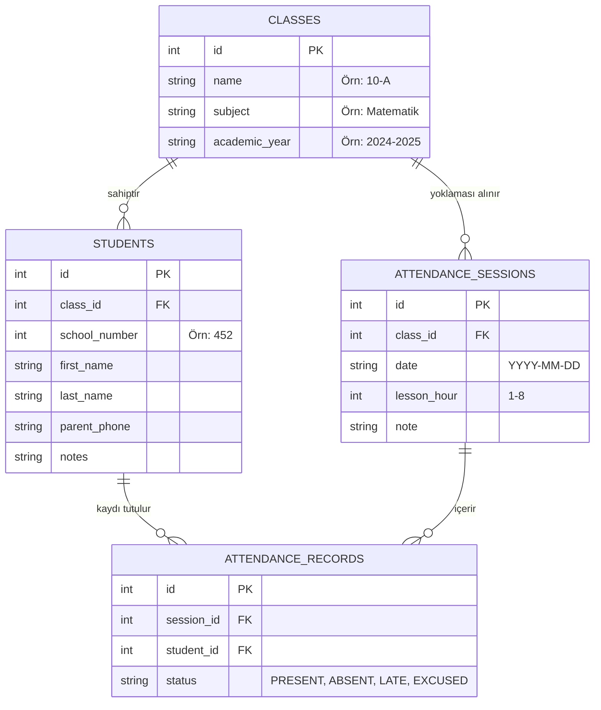

# 🏗️ SınıfCepte - Sistem Mimarisi ve Kod Yapısı

---

## 1. 📂 Proje Klasör Hiyerarşisi

```text
lib/
├── core/
│   ├── constants/       # Sabitler (AppStrings, AppConstants vb.)
│   ├── database/        # SQLite Veritabanı Yardımcısı (DatabaseHelper)
│   ├── theme/           # UI-UX-MAX Tema Yapılandırması
│   │   ├── app_colors.dart
│   │   └── app_theme.dart
│   └── utils/           # Tarih, Formatör ve PDF/Excel Yardımcıları
├── data/
│   ├── models/          # Veri Modelleri (ClassModel, StudentModel, AttendanceModel)
│   ├── repositories/    # Veritabanı Erişim Katmanları (DAO)
│   └── providers/       # Riverpod State Providers
├── features/
│   ├── attendance/      # Yoklama Alma Modülü (Screens & Widgets)
│   ├── classes/         # Sınıf & Öğrenci Yönetim Modülü
│   ├── performance/     # Performans & Not Takip Modülü
│   ├── schedule/        # Ders Programı Modülü
│   └── settings/        # Ayarlar & Yedekleme Modülü
├── shared/
│   ├── widgets/         # Yeniden Kullanılabilir Bileşenler (GlassCard, CustomButton vb.)
│   └── services/        # Excel / PDF / Printing Servisleri
└── main.dart            # Uygulama Giriş Noktası & ProviderScope
```

---

## 2. 🗄️ SQLite Veritabanı Şeması (Database Schema)



---

## 3. 🎨 UI-UX-MAX Tasarım Sistemi

- **Dark Background**: `#0F172A` (Deep Slate)
- **Dark Card Background**: `#1E293B` (Slate Navy)
- **Primary Color**: `#6366F1` (Indigo Moru)
- **Secondary Color**: `#3B82F6` (Electric Blue)
- **Accent & Success**: `#10B981` (Emerald Green)
- **Glassmorphism**: `GlassCard` widget'ı `BackdropFilter(sigmaX: 10, sigmaY: 10)` kullanarak cam efekti oluşturur.
- **Tipografi**: Google Fonts `Outfit`.

---

## 4. 🔄 State Yönetimi (Riverpod Strategy)

- **StateNotifierProvider / AsyncNotifierProvider**: Yoklama durumu, öğrenci listesi, sınıf seçimleri ve veritabanı CRUD işlemleri için reaktif durum yönetimi.
