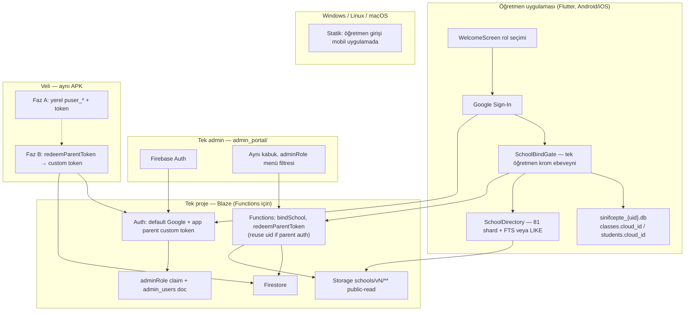
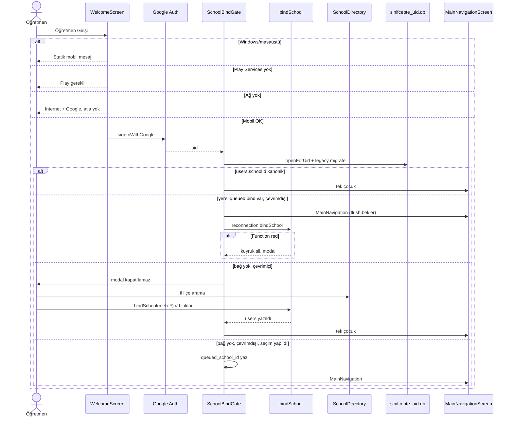
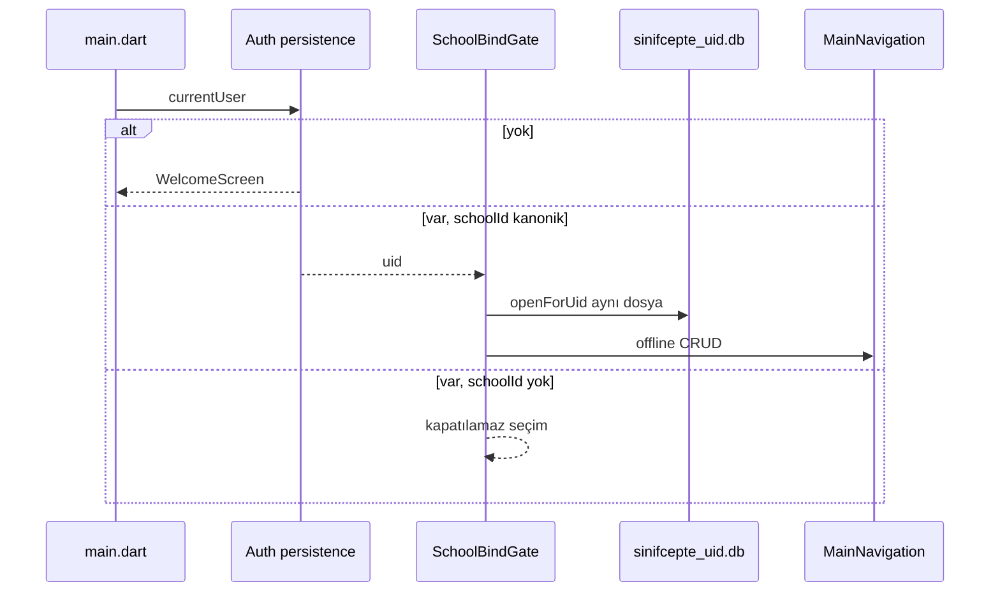
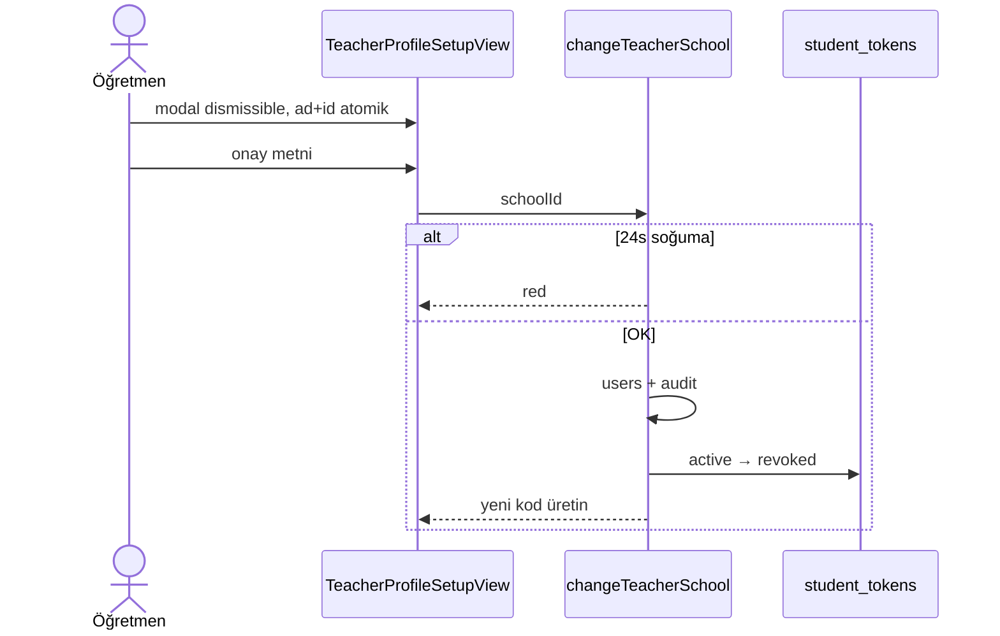
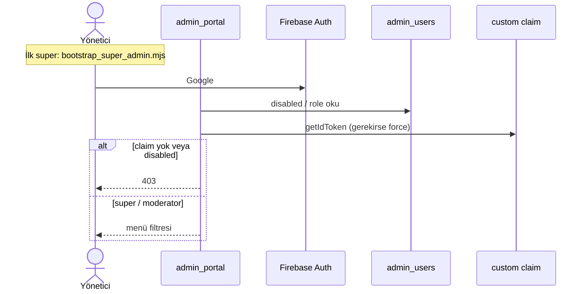
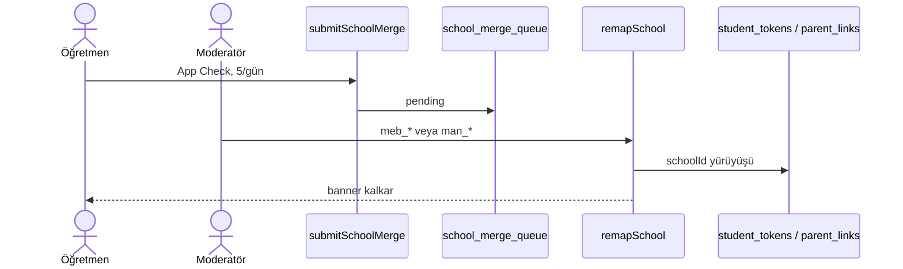
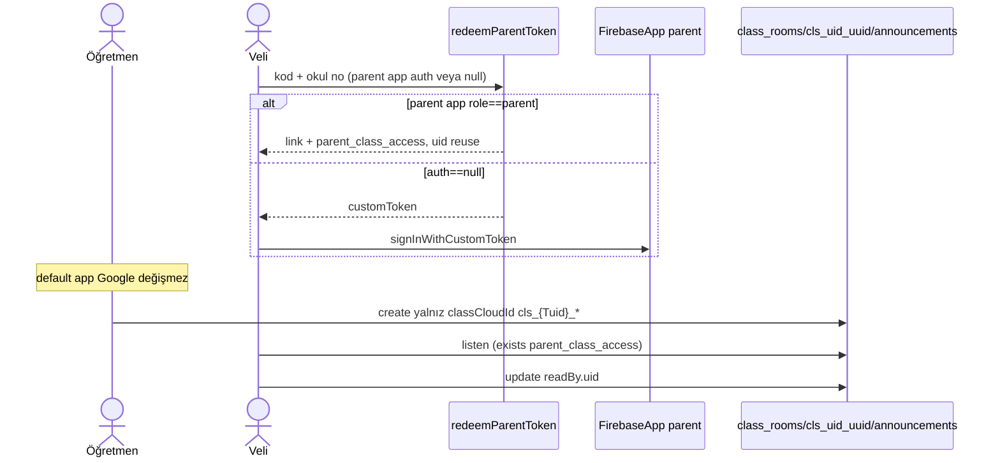
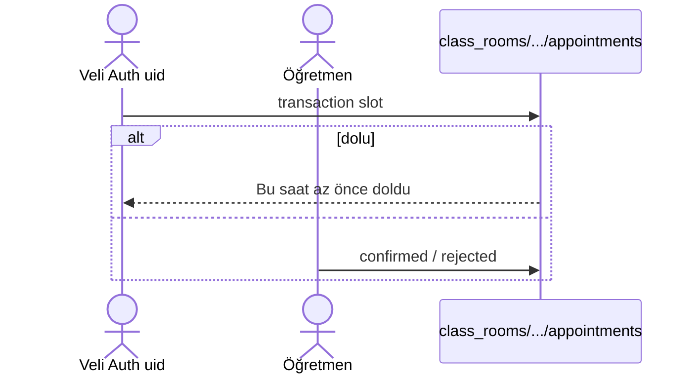
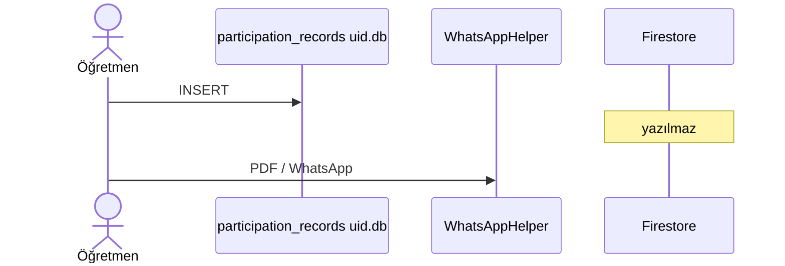

# SınıfCepte — Okul Dizini, Tek Admin Paneli, Google Öğretmen Girişi ve Daraltılmış Veli İş Akışı

| Alan | Değer |
|---|---|
| **Belge** | Mimari Tasarım Dokümanı |
| **Ürün** | SınıfCepte |
| **Yazar** | [Yazar adı] |
| **Tarih** | 2026-08-17 |
| **Durum** | Draft (revizyon 4 — inceleme 20) |
| **Kapsam kod tabanı** | `c:\Users\Okul\Desktop\Projelerim\sinifcepte` |
| **Hedef okuyucu** | Kıdemli mühendisler (mevcut Flutter + `admin_portal` kodunu tanıyan) |

---

## Overview

SınıfCepte bugün offline-first bir öğretmen asistanıdır: sınıf, öğrenci ve ders içi katılım `DatabaseHelper` (SQLite v10) içindedir; veli bağlantıları, duyurular ve randevular cihaz-içi `SharedPreferences` üzerindedir; kimlik yoktur — `WelcomeScreen` yalnızca rol seçer. Okul dizini fiilen boştur: `assets/data/schools_data.json` **174 okul / 18 il / 22,8 KB** içerir (Siirt 62, Bursa 20, İstanbul 20) ve `SchoolRepository._generateDistrictDefaultSchools` her ilçe için **35 sahte şablon** üretir (`tpl_{il}_{ilce}_...`). Yönetim yüzeyi üçe bölünmüştür: kimliksiz `admin_portal/` (LocalStorage CMS), Flutter `AdminPanelScreen` (gizli 5 dokunuş + varsayılan PIN `142857`) ve rol kapısız `SchoolAdminPanelModal` (öğretmen kendini doğrulayabilir).

Bu tasarım dört kilit kararı uygular: (1) MEB kurum kodu (`meb_734513`) ile 81 il shard’lı gerçek okul dizini, (2) tek web admin paneli içinde Süper Admin / Moderatör, (3) Google ile öğretmen girişi + atlanamaz okul bağlama, (4) velinin katılım/not/yıldız görmemesi — yalnızca duyuru, randevu ve mesaj. Öğretmen günlük CRUD offline kalır. Veli **Google’ı ürün olarak yok**; Faz B çapraz cihaz için yine de bir Firebase principal gerekir — `redeemParentToken` named `FirebaseApp('parent')` üzerinde custom token üretir (`role: parent`); varsayılan uygulama öğretmen Google oturumunu tutar. Öğrenci PII `sinifcepte_{uid}.db` dosyalarındadır (ilk uid legacy `sinifcepte.db`’yi devralır). `MainNavigationScreen` yalnızca `SchoolBindGate` altından açılır.

---

## Background & Motivation

### Mevcut durum (kodda doğrulandı)

| Katman | Gerçek | Dosya |
|---|---|---|
| Öğretmen veri | Tek dosya `sinifcepte.db` v10; `classes` / `students` / `participation_*`; öğretmen anahtarı yok | `lib/core/database/database_helper.dart:18–79` |
| `AppConfig.dbName` | Tanımlı (`sinifcepte_dev.db` / …) ama `DatabaseHelper` yok sayıyor | `app_config.dart:21–29` vs hardcoded `'sinifcepte.db'` |
| Kimlik | Yok. Rol `sinifcepte_active_user_role` | `welcome_screen.dart`, `user_role_provider.dart` |
| Öğretmen profili | SharedPreferences `profil_*`; varsayılan sahte “Yusuf Yılmaz / Atatürk Anadolu Lisesi”; `schoolId` opsiyonel | `teacher_profile_model.dart`, `teacher_profile_provider.dart:15–24` |
| Okul arama | Tek JSON + sahte şablonlar; debounce yok; `normalizeTr` var; varsayılan il `'Bursa'` | `school_repository.dart`, `school_selector_provider.dart:17–24` |
| Serbest okul adı | `TeacherProfileSetupView` “Okulunuzu seçin veya yazın…” | `teacher_profile_setup_view.dart:332–339` |
| Senkron | `SyncService` sabit v1; JS manifest `calendarVersion`, Dart `calendar_version` | `sync_service.dart`, `sync_manifest_model.dart:23–36`, `manifest_manager.js:7–15` |
| Backend | `pubspec.yaml` içinde Firebase / Crashlytics / Analytics yok | `pubspec.yaml` |
| Admin web | LocalStorage CMS; auth yok | `admin_portal/` |
| Admin Flutter | PIN düz metin `142857`; rota `AppRouter.adminPanel = '/admin'` | `admin_panel_repository.dart:15`, `app_router.dart:21` |
| Müdür modalı | `ProfileScreen` her öğretmene açık; `verifyTeacher` self-serve | `school_admin_panel_modal.dart:242–250` |
| `MainNavigation` kaçışları | `WelcomeScreen._checkAutoLogin`, veli `switch_teacher`, `AppRouter` `home`/`default` | `welcome_screen.dart:38–41`, `parent_dashboard_screen.dart:163–169`, `app_router.dart:26–49` |
| Veli “akademik” | Hardcoded %85 / %90 / %95 | `parent_dashboard_screen.dart` `_showAcademicsModal` |
| Veli token | Yerel `puser_{timestamp}`; `schoolId` boşsa `''`; `code` düz metin; salt `'sinifcepte_salt_2026'` | `parent_token_repository.dart:191–203, 464–476` |
| Prefs borç | `sinifcepte_parent_links_v1` vs `sinifcepte_parent_links`; `custom_user_schools_list` | token repo vs lifecycle vs `school_repository.dart:11` |
| Doküman sapması | PRD yoklama; mimari hâlâ Flutter süper admin | `docs/01-PRD.md`, `docs/02-ARCHITECTURE.md` |

### Ağrı noktaları

1. **Eksik dizin öğretmeni sahte okula bağlar.** `tpl_*` veli token’ına yazılır; Faz B birleştirmeyi öldürür.
2. **Üç admin yüzeyi güvenlik tiyatrosudur.** PIN kaynakta; portal açık; müdür self-verify.
3. **Rol seçimi kimlik değildir** ve `MainNavigation` kapısız açılır.
4. **Tek SQLite + Google** = hesap değişince öğrenci PII sızar (bugün tek kiracı; PR 3’ten sonra kritik).
5. **Veli ekranı yalan söyler** (hardcoded yüzde).
6. **Yerel `classId` INTEGER AUTOINCREMENT** yeniden kurulumda çakışır; bulut yolu buna dayanamaz.
7. **`ClassModel`’de `schoolId` yok** — kasıtlı; birleşim öğretmen bağından + kararlı `cloud_id`.

### Neden şimdi

`yeni_plan.md` shard + MEB kodu tarif eder; uygulama hâlâ 174 satır + şablon. Öğretmen kimliği, per-uid DB ve kanonik okul bağını kilitlemeden veli bulutu yazmak `sch_16_01` / `tpl_*` / paylaşılan `sinifcepte.db` felaketini kalıcılaştırır.

---

## Goals & Non-Goals

### Goals

1. ~55.000 MEB bağlı kurumun büyük çoğunluğu **il → ilçe → arama** ile bulunur; eksik okul istisnadır.
2. Kanonik `schoolId = meb_{kurumKodu}` (`YOL` doğrulanamazsa `meb_{ilKodu}_{kod}`).
3. Tek admin URL / tek kabuk; `super` | `moderator`; bootstrap script + Blaze/Functions gerçeği.
4. Öğretmen Google; `SchoolBindGate` olmadan `MainNavigationScreen` **hiçbir** giriş noktasından açılamaz.
5. Bağlı öğretmen çevrimdışı sınıf / katılım / sınav kullanır; hesaplar `sinifcepte_{uid}.db` ile yalıtılır.
6. Veli yüzeyinden katılım / davranış / not kalkar.
7. Faz B ince bulut: duyuru / randevu / mesaj / token; veli principal = `redeemParentToken` custom token (Google değil).
8. Anayasa: yoklama yok, dual error handling, sıfır taşma, KVKK allow-list.

### Non-Goals

- Veli Google / telefon OTP (Faz C).
- Okul müdürü ürün yüzeyi / okul-içi RBAC.
- Katılım / yıldız / kazanım senkronu.
- Yoklama / e-Okul yoklama.
- Çoklu okul (v1 = bir birincil).
- Öğrenci PII’sinin allow-list dışı buluta çıkması (veli telefonu, okul no, ham token, sınıf listesi, katılım).
- Tam sohbet (medya, grup).
- Flutter PIN admin veya ikinci admin uygulaması.
- Windows/Linux/macOS öğretmen üretimi (v1).
- E-posta sihirli link veya Huawei/AppGallery alternatif kimliği (v1).
- Canlı MEB HTTP’nin CI / mağaza build’ine bağlanması.

---

## Proposed Design

### Hedef mimari



---

### A. Okul dizini — tamamlama

#### A.1 Veri kaynağı ve yasal / operasyonel gerçek

**Canlı AJAX birincil umut değil, bir deneme kanalıdır.** Bu incelemede kimliksiz `okullar_ajax.php` çağrısı `Erişim yetkiniz yok!` döndü. `YOL = {il}/{ilce}/{kurumKodu}` üçüncü parti kazıyıcıların tarifidir; **doğrulanmış olgu değildir.**

Kaynak sırası (ilk başarılı olan üretir):

| Öncelik | Kaynak | Ne zaman |
|---|---|---|
| 0 | **Repo içi mühürlü fixture** `scripts/schools/fixtures/meb_raw_{YYYYMMDD}.jsonl.zst` + `SHA256SUMS` | PR 1 merge öncesi zorunlu. CI ve `build_shards.py` **yalnızca** bunu okur. |
| 1 | Tek seferlik operatör çekimi: HTML listesi `.../okullar/index.php` + (çalışırsa) AJAX | İnsan, tarayıcı benzeri header; CI’da yok |
| 2 | Süper admin’in yüklediği **herhangi** CSV/JSON (şema eşlemesi) | MEBBİS şart değil; ekibin bakanlık hesabı olmayabilir |
| 3 | Önceki yayınlanmış paket (`schools/v{N-1}`) | Canlı dizin asla boşalmaz |

MEBBİS `KurumListesi.aspx` **yedek olarak anılmaz** — kimlikli bakanlık sistemi, 2–5 kişilik ekipte erişim yok varsayılır.

**Çekim protokolü (kanal 1, insan çalıştırır):**

```
POST https://www.meb.gov.tr/baglantilar/okullar/okullar_ajax.php
Referer: https://www.meb.gov.tr/baglantilar/okullar/index.php
User-Agent: SinifCepteSchoolImport/1.0 (+mailto:destek@sinifcepte.app)
Accept: application/json
Content-Type: application/x-www-form-urlencoded
body (DataTables): draw=1&start={offset}&length=100&ILKODU={01-81}
delay: 400–800 ms / istek
```

Parser sözleşme testi (`test/schools/meb_raw_parser_test.dart` + küçük golden): beklenen anahtarlar `OKUL_ADI` / `IL` / `ILCE` ve varsa `YOL` veya eşdeğer kod alanı. Alan yoksa test kırmızı, üretim id kuralı A.3’e düşer.

**Kanonik id (varsayım + yedek):**

1. `YOL` son segmenti rakam ve dump içinde **küresel benzersiz** → `meb_{segment}`.
2. Aksi halde `meb_{ilKodu}_{stabilizeKod}` (`HOST` veya slug). İlk dump script’i `assert_unique_ids.py` çalıştırmadan shard yazmaz.
3. Çakışma → satır `unmapped` raporuna; yayına girmez.

**Hukuk (tek paragraf):** Dizin kamuya açık kurum adları / il / ilçe / kurum kodudur; öğrenci veya veli PII’si yoktur. APK ve CDN’de yeniden dağıtım “kamu kurum listesi, ticari olmayan eğitim aracı, kaldırma talebi `destek@sinifcepte.app`” notuyla yapılır. robots/ToS değişirse çekim durur, fixture + admin yüklemesi devam eder. Mağaza / CI canlı MEB HTTP çağırmaz.

#### A.2 İçeri aktarma boru hattı

| Script | Görev |
|---|---|
| `scripts/schools/fetch_meb_okullar.py` | **Yalnızca operatör makinesi.** Fixture üretir; CI’da yok. |
| `scripts/schools/normalize_schools.py` | Ham → kanonik satır; id kuralı A.3 |
| `scripts/schools/build_shards.py` | Fixture’dan 81 `tr_{il}.json.gz` + `schools_manifest.json` |
| `scripts/schools/diff_pack.py` | Önceki pakete göre eklenen / kapanan |
| `scripts/schools/assert_unique_ids.py` | Merge kapısı |
| `admin_portal/js/school_pack_manager.js` | PR 2: CSV/JSON yükle + yayın |

**Tek okul türü tablosu** (modal, normalizer, shard — aynı sıra):

| `type` değeri | Kaynak ipucu (ad) |
|---|---|
| `İlkokul` | İlkokul |
| `Ortaokul` | Ortaokul |
| `İmam Hatip Ortaokulu` | İHO, İmam Hatip Ortaokulu |
| `Anadolu Lisesi` | Anadolu Lisesi, ÇPAL |
| `Fen Lisesi` | Fen Lisesi |
| `Anadolu İmam Hatip Lisesi` | İHL |
| `Mesleki ve Teknik Anadolu Lisesi` | MTAL, Mesleki |
| `Sosyal Bilimler Lisesi` | Sosyal Bilimler |
| `Özel Okul / Kolej` | Özel, Kolej |
| `BİLSEM` | BİLSEM, Bilim ve Sanat |
| `Diğer` | HEM, RAM, eşleşmeyen |

`SchoolSelectionModal._schoolTypes` bu tabloya genişler (`BİLSEM`, `Diğer` eklenir). `Tümü` yalnızca UI filtresidir, shard alanı değildir.

İl / ilçe `provinces_districts.json` + `normalizeTr` ile hizalanır; kaçan ilçe `unmappedDistricts` raporuna düşer.

**Dahil:** resmi/özel okul, İHO/İHL, MTAL, BİLSEM, HEM, RAM.  
**Hariç (yayın UI’sinde açılır):** il/ilçe MEM, bakanlık birimi, adsız pansiyon.

#### A.3 Kanonik şema

```dart
class SchoolModel {
  final String id;            // meb_734513 | meb_16_xxx | pending_{uuid} | man_{uuid}
  final String name;
  final String city;
  final String cityCode;      // "16" — shard ve FTS
  final String district;
  final String type;          // A.2 tablosu
  final bool isCustom;
  final String? mebKurumKodu;
  final String status;        // active | pending_review | merged | closed
  final String source;        // resmi_liste | manuel_onayli | admin_upload
  final String? mergedIntoId;

  Map<String, dynamic> toShardMap();      // wire
  factory SchoolModel.fromShardMap(...);  // city + cityCode zorunlu
  factory SchoolModel.fromMap(...);       // eski 5 alan: cityCode '' → il adından çöz
}
```

Shard JSON:

```json
{
  "id": "meb_734513",
  "meb_kurum_kodu": "734513",
  "name": "Cumhuriyet Ortaokulu",
  "city": "Bursa",
  "city_code": "16",
  "district": "Nilüfer",
  "type": "Ortaokul",
  "status": "active",
  "source": "resmi_liste"
}
```

`assets/data/schools_data.json` PR 1’de `legacy/` altına alınır; runtime okunmaz.

#### A.4 Depolama — 55k RAM’e yüklenmez; FTS yeri kilitli

**Karar: 81 gzip shard + aynı anda tek il. FTS/LIKE tabloları öğretmen DB’sindedir (`sinifcepte_{uid}.db`, v11). Ayrı `schools.db` yok.**

Gerekçe: tek `DatabaseHelper`, tek migration; dizin PII değildir ama ikinci bağlantı/FFI yüzeyi açılmaz. Hesap değişince o uid’nin DB’sinde FTS ılık veya soğuk yüklenir (bütçe A.5).

```
assets/data/schools/
  schools_manifest.json
  tr_01.json.gz … tr_81.json.gz
```

Gzip okuma (asset ve cache): `rootBundle.load` → `bytes` → `utf8.decode(gzip.decode(bytes))`. `loadString` kullanılmaz.

Uygulama belgeler dizini:

```
schools_cache/manifest.json
schools_cache/tr_16.json.gz
sinifcepte_{uid}.db   # v11: schools, schools_fts, school_shards + classes.cloud_id
```

```sql
CREATE TABLE schools (
  id TEXT PRIMARY KEY,
  meb_kurum_kodu TEXT,
  name TEXT NOT NULL,
  name_norm TEXT NOT NULL,
  city TEXT NOT NULL,
  city_code TEXT NOT NULL,
  district TEXT NOT NULL,
  district_norm TEXT NOT NULL,
  type TEXT NOT NULL,
  status TEXT NOT NULL DEFAULT 'active',
  source TEXT NOT NULL DEFAULT 'resmi_liste'
);

-- FTS5 denemesi (onCreate/onUpgrade try/catch)
CREATE VIRTUAL TABLE IF NOT EXISTS schools_fts USING fts5(
  name_norm,
  district_norm,
  school_id UNINDEXED,
  tokenize = 'unicode61 remove_diacritics 2'
);

CREATE TABLE school_shards (
  city_code TEXT PRIMARY KEY,
  version INTEGER NOT NULL,
  sha256 TEXT NOT NULL,
  loaded_at TEXT NOT NULL
);
```

`name_norm` / `district_norm` = `SchoolRepository.normalizeTr` çıktısı (FTS tokenizer’a güvenilmez; biz önceden katlanırız).

**FTS yoksa (sqflite_common_ffi / bazı Android):** `SchoolRepository._ftsAvailable = false`; arama `WHERE city_code=? AND name_norm LIKE ?` (`%$q%`). İlçe/tür aynı SQL.

`ensureProvinceLoaded(cityCode)`:

1. Artan `_loadGen` tut; yeni çağrı eskisinin insert’ini yutar (çift il <400 ms yarışı).
2. Transaction: `DELETE FROM schools WHERE city_code != ?` (tek il değişmezi) + yeni satırlar + FTS rebuild (`schools_fts` varsa `INSERT INTO schools_fts(schools_fts) VALUES('rebuild')` veya drop/recreate).
3. Kaynak sırası: `school_shards` sürümü == yerel manifest → no-op; değilse cache gzip → asset gzip → CDN.
4. sha256 uymazsa dosyayı sil, bir sonraki kaynağa geç.

`_generateDistrictDefaultSchools` ve `_cachedSchools` **silinir**.

#### A.5 Arama UX

| Bugün | Hedef |
|---|---|
| Debounce yok | 150 ms, `SchoolSelectionModal` içi `Timer` |
| 35 şablon / ilçe | Yalnızca `status=active` gerçek satır |
| `addCustomSchool` → `custom_*` | Fuzzy ≥ 0,85 öner; değilse kuyruk |
| `SchoolSelectionModal.show` `isDismissible` varsayılan true | Kapı modu: `isDismissible: false` + `PopScope(canPop: false)`. Profil değişimi: kapatılabilir, mevcut bağ geçerli |
| `selectedSchoolCityProvider` → `'Bursa'` | Boş string; il yokken liste boş |
| Serbest “yazın…” | **Yok.** Ad + id atomik; `TextFormField` readOnly, yalnızca modal |

**Fuzzy:** yeni paket yok. `lib/features/schools/data/utils/normalized_levenshtein.dart` — `normalizeTr` sonrası Levenshtein; skor `1 - d/max(len)`. Yüklü il (≤ ~4,5k) üzerinde; FTS adaylarını (prefix) kesip 3 sonuç.

Hedef gecikme ve bozulma yolu:

| Ölçüt | Hedef | Aşılırsa |
|---|---|---|
| Soğuk yük (İstanbul ~4k) | ≤ 400 ms p75, ≤ 1200 ms p95 | İlerleme + “Arama LIKE ile” ; FTS arka planda |
| Ilık FTS / LIKE | ≤ 40 ms / ≤ 80 ms p95 | Debounce 250 ms |
| İlk açılış, asset var | 0 byte ağ | — |
| CDN yedek | 30–130 KB / il | Asset’e düş |

#### A.6 Boyut

55k × ~160 B ≈ 8,8 MB ham; gzip **~2,0–2,6 MB**. İstanbul ~90–130 KB gzip. **Tüm gzip’ler APK’da** (kırsal çevrimdışı seçim). Şişerse PR 1 ölçümüyle büyük iller CDN-only yapılabilir.

Wire manifest (**yalnızca snake_case** — Dart `fromMap` ile aynı; JS export bu anahtarları yazar):

```json
{
  "calendar_version": 4,
  "outcomes_version": 7,
  "announcements_version": 2,
  "school_directory_version": 12,
  "min_app_version": "1.0.0",
  "latest_app_version": "1.0.0",
  "maintenance_mode": false,
  "maintenance_message": null,
  "last_updated": "2026-08-17T10:00:00Z",
  "pack_base_url": "https://sinifcepte-prod.web.app/schools/v12/",
  "source": "fixture_20260816",
  "source_fetched_at": "2026-08-16T21:00:00Z",
  "total_schools": 54812,
  "provinces": [
    { "code": "16", "name": "Bursa", "count": 1184, "file": "tr_16.json.gz", "sha256": "…" }
  ]
}
```

Dart alanları wire’ı bire bir okur (`school_directory_version` → `schoolDirectoryVersion`). Firestore `sync/manifest` aynı JSON. Üç isim yok.

#### A.7 Manuel ekleme

`addCustomSchool` / `custom_user_schools_list` kalkar. Eski `custom_*` id’ler bağsız sayılır (C.2).

1. Ad + il + ilçe + tür.
2. `normalized_levenshtein` en iyi 3; ≥ 0,85 → “Bunu mu demek istediniz?”
3. Değilse yerel `pending_school_submissions`; ağda callable `submitSchoolMerge` (App Check, uid başına 5/gün).
4. Öğretmen `pending_{uuid}` ile bağlanır; banner “Onay bekliyor”.
5. Moderatör `meb_*` birleştirir veya `man_{uuid}` yayınlar.
6. Function `remapSchool` `users.schoolId`, `parent_links.schoolId`, `parent_class_access.schoolId`, `student_tokens.schoolId` ve istemci `applySchoolRemap` (yerel token + profil) günceller.

#### A.8 Yayın ve SyncService

Yalnızca Süper Admin, **Function `publishSchoolPack`** (istemci Storage’a yazamaz):

1. Fixture veya yüklenen CSV → shard.
2. Diff.
3. Function: `schools/v{N}/**` yükle, `sync/manifest` atomik, `school_directory_version++`.
4. `v{N-2}` silinebilir; `v{N-1}` rollback.

Storage kuralı:

```
match /schools/{version}/{file} {
  allow read: if true;
  allow write: if false; // yalnız Admin SDK
}
```

`pack_base_url` = Firebase Hosting (`/schools/**` → Storage veya Hosting public klasör). İlk sürüm Hosting public yeter.

`SyncService`: HTTP GET manifest (ETag); `school_directory_version` > yerel ise **yalnızca yüklü il** + sha256 + FTS/LIKE rebuild. Takvim/kazanım aynı `sync_metadata` anahtarları (`sync_school_directory` ek).

---

### B. Tek admin paneli

#### B.1 Ev sahibi

**`admin_portal/` evrilir.** Flutter web CMS yeniden yazılmaz. Uygulama içi PIN emekli. Aynı origin, `adminRole` menü filtresi.

#### B.2 Kimlik, bootstrap, Blaze

**Firebase Auth (Google) + custom claim `adminRole` + Firestore `admin_users/{uid}`.**

Firebase Console’da custom claim UI **yoktur.** `auth.setCustomUserClaims` yalnız Admin SDK.

**PR 2’de `scripts/admin/bootstrap_super_admin.mjs`:**

```
# service account JSON şifre yöneticisinde; asla commit edilmez
node scripts/admin/bootstrap_super_admin.mjs --email you@domain --uid <firebaseUid>
# 1) setCustomUserClaims({ adminRole: 'super' })
# 2) admin_users/{uid} = { email, role: 'super', disabled: false, createdAt }
# 3) stdout: "portalda çıkış/giriş veya getIdToken(true)"
```

Tavuk-yumurta: `auth_gate` deploy edilmeden önce bu script bir kez çalışır. `setAdminRole` callable **yalnızca mevcut super**; ilk super script’tir.

**Blaze:** Cloud Functions Spark’ta yok. `setAdminRole`, `publishSchoolPack`, `writeAuditLog`, `bindSchool` / `changeTeacherSchool`, `submitSchoolMerge`, `remapSchool`, (PR 5) `redeemParentToken` Function ister. **PR 2 Functions deploy etmeden Blaze açılır.** Spark’ta kalınırsa portal yalnızca `admin_users` okuyan kurallarla “görüntüle” olur, claim yazılamaz, yayın yapılamaz — bu v1 hedefi değildir.

**Çift kaynak:** Function claim **ve** `admin_users` dokümanını birlikte yazar. Portal UI `admin_users` okur; Storage/Firestore kuralları `request.auth.token.adminRole`. Claim gecikmesi: her rol değişiminde istemci `getIdToken(true)`. Eski token en fazla ~1 saat; UI yine `disabled` dokümanına bakar.

**Kırılma camı:** En az **iki** super tutulur (`setAdminRole` son super’ı `disabled` yapamaz). İkisi de kaybedilirse: aynı bootstrap script + service account (1Password). Runbook: `admin_portal/README.md` “Kurtarma”.

App Check (reCAPTCHA v3) portal + callable.

Öğretmen ve admin aynı projede, ayrı claim dünyası. Aynı kişi her iki rolde olabilir (sizin hesap).

#### B.3 Yetki matrisi

| Yetenek | Süper Admin | Moderatör |
|---|---|---|
| Panel girişi | Evet | Evet |
| Okul paketi yayın | Evet | Salt okunur önizleme |
| Birleştirme kuyruğu | Evet | Evet |
| Takvim / kazanım / sınav içerik | Evet | Evet |
| Manifest / bakım / sistem duyurusu | Evet | Hayır |
| Şikayet çöz | Evet | Evet |
| Öğretmen bağını gör | Evet | Evet |
| Bağ zorla çöz / `disabled` | Evet | Hayır |
| Moderatör davet | Evet | Hayır |
| Super claim | Evet (≥1 super kalır) | Hayır |
| Audit oku | Evet | 90 gün |
| Audit sil | Hayır | Hayır |

`AdminRequestModel` / müdür başvurusu **taşınmaz**.

#### B.4 Sekmeler

Mevcut CMS sekmeleri + Okul Dizini, Birleştirme Kuyruğu, Şikayetler, Öğretmen bağları, Ekip (super), Denetim. LocalStorage → tek seferlik “İçe aktar”.

#### B.5 Flutter admin

`lib/features/admin_panel/` **tamamen silinir** (boşaltılmaz). Testler düzeltilir veya silinir. PIN, 5 dokunuş, müdür kartı, `AppRouter.adminPanel`, `verifyTeacher`, `submitAdminRequest` yok. Ayrıntı Cleanup.

---

### C. Google öğretmen girişi + zorunlu bağ

#### C.1 Yığın ve platform matrisi

**Firebase Auth (Google) + Firestore + Hosting/Storage + Functions (Blaze).** Yerel-only kaybeder. Supabase şimdi yok.

Paketler: `firebase_core`, `firebase_auth`, `google_sign_in`, `cloud_firestore`, `firebase_storage`, `firebase_app_check`, `firebase_crashlytics`. Analytics zorunlu değil; alarm için Crashlytics + mevcut `debugPrint` yeter. İstenirse sonra `firebase_analytics`.

| Platform | v1 davranış |
|---|---|
| Android (Play Services var) | Google zorunlu |
| iOS | Google zorunlu |
| Android Play Services yok / Huawei / sideload | Tam ekran: “Google Play Hizmetleri gerekli.” Mağaza linki. **Yeniden dene** yalnızca Play kontrolü. Alternatif kimlik yok. |
| Windows / Linux / macOS | `google_sign_in` **çağrılmaz.** Statik: “Öğretmen girişi Android ve iOS uygulamasındadır.” Retry döngüsü yok. `sqflite_common_ffi` dizin araçları / mevcut masaüstü debug için kalabilir; öğretmen oturumu yok. |

E-posta sihirli link **v1 yolu değildir** (cümle silindi).

Firebase proje dosyaları (`google-services.json`, `GoogleService-Info.plist`, `firebase.json`) **PR 2**’de eklenir; PR 3 onları kullanır.

#### C.2 Kimlik ve per-uid SQLite

`users/{uid}`:

```
email, displayName, photoUrl,
schoolId,            // yalnız Function yazar
schoolName, city, district, schoolType,
boundAt, lastSchoolChangeAt,
role: "teacher",     // Function / Auth bootstrap
createdAt,
disabled             // yalnız admin Function
```

Yerel profil: `profil_{uid}_*` (paylaşılan `profil_okul` sızıntısı yok). `TeacherProfileModel.id` = uid. Yusuf/Atatürk varsayılanı yok.

**Karar — cihaz yalıtımı:** `DatabaseHelper` `AppConfig.teacherDbName(uid)` → `sinifcepte_{uid}.db` (dev’de `sinifcepte_dev_{uid}.db`). Aynı Google yeniden giriş = aynı dosya. Başka uid = boş DB (aşağıdaki tek seferlik legacy devir hariç). Çalışma zamanında paylaşılan `sinifcepte.db` **açılmaz**.

**Legacy migrasyon (PR 3, ilk Google uid):**

1. `openForUid(uid)` önce varsa açık `Database`’i `close()` eder, `_database = null`, `_openedUid` sıfırlanır. Başka uid’nin cache handle’ı **asla** dönmez.
2. Hedef `sinifcepte_{uid}.db` yok **ve** legacy dosya var (`sinifcepte.db` veya `AppConfig.dbName`, örn. `sinifcepte_dev.db`) → dosya kopyalanır (veya tablo kopyası), sonra legacy `sinifcepte.db.migrated` (dev: `sinifcepte_dev.db.migrated`) olarak yeniden adlandırılır.
3. Yalnızca **ilk** uid legacy’yi devralır. İkinci Google hesabı boş DB açar; `writeAuditLog(legacy_db_not_inherited)` + `debugPrint`.
4. Test: legacy’ye sınıf ekle → `openForUid(u1)` sınıf sayısı korunur → `openForUid(u2)` 0 sınıf; `u1` handle’ı kapanmış olmalıdır.

- `signOut`: varsayılan (öğretmen) Auth + rol; **mevcut uid DB’si silinmez.** Named `parent` uygulamasına dokunulmaz (veya tersi).
- Hesap değişimi: yeni uid, `openForUid` close+null, yeni dosya; A’nın sınıfları görünmez.
- Token iptal: öğretmen çıkışı; o uid dosyası diskte kalır.
- İsteğe bağlı “Bu hesaptaki yerel veriyi sil” (onaylı) ayrı aksiyon.

v11 aynı dosyada: `schools*` + `classes.cloud_id TEXT NOT NULL` + `students.cloud_id TEXT NOT NULL` (uuid, istemci üretir, reinstall’da yeni uuid = yeni bulut sınıfı; AUTOINCREMENT çakışması olmaz). **`classes.school_id` eklenmez.**

Faz B birleşim: `schoolId + teacherUid + class.cloud_id + student.cloud_id`.

#### C.3 Okul değişimi — sunucu zorunlu

İstemci diyaloğu UX’tir; yetki değildir.

Callable **`changeTeacherSchool({ schoolId })`** (App Check):

1. `disabled` ise red.
2. `schoolId` `meb_*` / `man_*` / `pending_*` değilse red.
3. İlk bağ (`boundAt == null`) soğumasız.
4. Aksi halde `now - lastSchoolChangeAt < 24h` ve çağıran admin değilse red.
5. `pending_*` → `meb_*` remap soğumasız (`remapSchool`).
6. `users/{uid}` güncelle; `writeAuditLog(teacher_school_changed)`.
7. Bu `teacherUid` için `student_tokens` `status in [active]` → `revoked`. Öğretmen yeni kod üretir.

İstemci `users/{uid}` `schoolId` yazamaz (kurallar). Super soğuma sıfırlar: `resetSchoolChangeCooldown` + audit.

#### C.4 Çevrimdışı / kapı

| Durum | Davranış |
|---|---|
| Mobil ilk kurulum, ağ yok | Google blocking; atla/misafir yok |
| Play Services yok | C.1 Huawei satırı |
| Masaüstü | C.1 statik mesaj |
| Oturum + kanonik `users.schoolId` + ağ yok | `SchoolBindGate` → `MainNavigation`; `{uid}.db` |
| Oturum, bulut bağ yok, ağ yok, öğretmen okul seçti | Yerel kuyruk (`profil_{uid}_queued_school_id` = `meb_*` / `pending_*`). Gate bunu **yeterli** sayar → `MainNavigation`. Yeniden bağlanınca `bindSchool` flush. Function red → Gate’e dönüş, kuyruk silinir, modal yeniden. |
| Oturum, bağ yok, çevrimiçi ilk bağ | `bindSchool` **bloklar**; Function OK olmadan `MainNavigation` yok |
| Başka Google aynı telefonda | `openForUid`; legacy yoksa boş sınıflar |

Yerel kuyruk alanı: `profil_{uid}_queued_school_id` + `queued_school_name` + `queued_at`. Flush başarılı olunca silinir; `users.schoolId` kaynak gerçek olur.

#### C.5 Veli Google yok; Faz B principal ayrı uygulama

Faz A: `sinifcepte_local_parent_id` = `puser_*` (cihaz).  
Faz B: `parentUserId` **named `FirebaseApp('parent')` üzerindeki Auth uid**’dir.

**Çift FirebaseApp (zorunlu):**

| Uygulama | Kullanım |
|---|---|
| Varsayılan (`Firebase.app()`) | Öğretmen Google. `SchoolBindGate` yalnız bunu okur. |
| Named `parent` (`Firebase.app(name: 'parent')`) | Yalnız `redeemParentToken` custom token. `FirebaseAuth.instanceFor(app: parentApp)` |

- Rol değişimi (`Veli Moduna Geç` / `switch_teacher`) varsayılan uygulamada **`signOut` çağırmaz.**
- Faz B veli `signInWithCustomToken` **yalnız** `parent` app’te. Öğretmen `currentUser` yerinde kalır.
- Veli çıkışı: `parent` app `signOut`; öğretmen Google’a dokunulmaz.
- Aynı cihazda iki çocuk: aynı `parent` uid’ye ikinci `redeem` (aşağı D.5).
- Faz C Google “tek satır migrate” **değildir.**

---

### D. Veli görünürlüğü

#### D.1 Çıkanlar

Gelişim kartı, `_showAcademicsModal`, `_buildAcademicProgressItem` silinir. `participation_*` Firestore’a yazılmaz. WhatsApp/PDF bant dışı kalır.

#### D.2 Kalan yüzey (Faz A yerel)

Duyuru, durum kartı, randevu, öğretmen kadrosu. Sahte kadro (`Selin Şahin` … `parent_portal_repository.dart:233–277`) **PR 4’te** boş duruma çekilir.

#### D.3 Mesaj (yerel model PR 4, bulut DTO PR 5)

```dart
class ClassMessageModel { /* yerel, int classId */ }
class ClassMessageCloudDto {
  String id, schoolId, teacherUid, classCloudId, studentCloudId, parentUserId;
  String senderRole; // teacher | parent
  String body; // max 2000, InputSanitizer
  DateTime createdAt;
  DateTime? readAt;
}
```

`studentCloudId` **zorunlu** ayrıca `AppointmentCloudDto` ve `StatusReportCloudDto` üzerinde (yerel int `studentId` değil). Sınıf duyurusu öğrenci id taşımaz.

ACL ayrımı: duyuru = sınıf kapsamı (`parentHasClass`). Randevu / mesaj / durum kartı = **öğrenci kapsamı** (`parentHasStudent` → `exists(parent_links/{uid}_{studentCloudId})`). Aynı sınıftaki başka çocuğun ilacı veya 1:1 konusu okunamaz.

Yerel `toMap()` buluta gitmez. Rate: öğretmen 30/saat/sınıf, veli 10/saat/çocuk (Function).

#### D.4 Faz A / B

| | Faz A (PR 4, 1, 2, 3) | Faz B (PR 5) |
|---|---|---|
| Dizin + admin + Google bağ | Evet (sırayla) | — |
| Veli akademiği yok | PR 4 | — |
| Veli kimliği | `puser_*` | Named `parent` app uid; ikinci çocuk reuse |
| Çapraz cihaz comms | Hayır | Evet |
| Katılım bulutu | Hayır | Hayır |

#### D.5 Faz B kimlik — `redeemParentToken` (veli Google yok)

```
callable redeemParentToken({ code, secondFactor })
  App Check zorunlu
  IP rate: 5/dk, 20/saat (unauth); auth parent için 20/saat/uid

  serverPepper hash; istemci tuzu kullanılmaz
  token yok / expired / revoked / failedAttempts≥5 → red
  2FA uymaz → failedAttempts++; 5’te revoked
  linkedParentCount >= maxLinkedParents → red
    // kota öğrenci token’ı başına; aynı veli ikinci çocukta yeni token

  parentUid:
    request.auth != null && request.auth.token.role == 'parent'
      → AYNI uid (createUser YOK). İkinci / üçüncü çocuk bu hesaba eklenir.
    request.auth == null
      → createUser + claims { role: 'parent' } + customToken
    request.auth var ama teacher Google (default app)
      → red: "veli redeem named parent app üzerinden, auth==null veya role==parent"

  yazmalar (aynı transaction):
    parent_links/{parentUid}_{studentCloudId}     // tek öğrenci, ikiz çarpışmaz
    parent_class_access/{parentUid}_{classCloudId} // boş/min doküman; duyuru exists() O(1)
    student_tokens.linkedParentCount++

  dönüş: customToken (yalnız createUser dalı) veya { reused: true, uid }
```

İstemci: `FirebaseAuth.instanceFor(app: Firebase.app('parent')).signInWithCustomToken` (yeni kullanıcı). Oturum açık parent’ta ikinci redeem token dönmez, yalnız link yazar.

`getMyConnectedChildren()` = `parent_links` where `parentUserId == parentUid` (birden fazla öğrenci, aynı sınıf dahil).

Claims’te `links[]` yok. Duyuru yetkisi `exists(parent_class_access/{uid}_{classCloudId})`. Randevu/mesaj/status `exists(parent_links/{uid}_{studentCloudId})`.

**Unlink** (öğretmen veya admin Function `unlinkParentStudent`):

1. `parent_links/{parentUid}_{studentCloudId}` sil.
2. Aynı `parentUid` + `classCloudId` için başka `parent_links` kalmış mı bak (kardeş / ikiz).
3. Kalmadıysa `parent_class_access/{parentUid}_{classCloudId}` sil. Kaldıysa access durur (duyuru devam).
4. `student_tokens.linkedParentCount` azalt (min 0). Audit `parent_link_removed`.

**İkinci cihaz (dürüst v1):** `parent` app oturumu yoksa yeni redeem = yeni uid + bir `maxLinkedParents` slotu. Aynı telefon, oturum açıkken ikinci çocuk slot yemez (reuse). Faz C Google birleştirir.

Ham `code` karttan sonra silinir; QR’da `student_name` yok.

---

## API / Interface Changes

```dart
abstract class TeacherAuthService {
  Stream<TeacherAuthUser?> authStateChanges(); // FirebaseAuth.instance (default app)
  Future<TeacherAuthUser> signInWithGoogle(); // yalnız Android/iOS + Play
  Future<void> signOut(); // default app; parent app'e dokunma; DB silinmez
}

abstract class ParentAuthService {
  // FirebaseAuth.instanceFor(app: Firebase.app('parent'))
  Stream<User?> authStateChanges();
  Future<void> redeemAndSignIn({required String code, required String secondFactor});
  Future<void> signOut(); // yalnız parent app
}

class SchoolBindGate extends ConsumerWidget {
  // TEK öğretmen krom ebeveyni. Yalnız default app currentUser.
  // Auth yok → Welcome.
  // users.schoolId kanonik VEYA yerel queued bind → MainNavigation.
  // İkisi de yok → kapatılamaz modal.
}

// DatabaseHelper
static Future<void> openForUid(String uid);
// 1) if (_openedUid == uid && _database != null) return cached
// 2) await _database?.close(); _database = null; _openedUid = null
// 3) maybeMigrateLegacy(uid)  // kopyala + rename .migrated; yalnız ilk uid
// 4) open AppConfig.teacherDbName(uid)

Future<void> ensureProvinceLoaded(String cityCode); // iptal token'lı
```

**`MainNavigationScreen(` kurulum denetim listesi (PR 3 kapısı):**

| Yer | Yeni hedef |
|---|---|
| `WelcomeScreen._handleTeacherLogin` | Google → `SchoolBindGate` |
| `WelcomeScreen._checkAutoLogin` | `isTeacher` iken bile Gate; Auth yoksa Welcome |
| `ParentDashboardScreen` `switch_teacher` | Default app Google kalır (signOut yok) + Gate |
| `ProfileScreen` “Veli Moduna Geç” | Rol kromu; default Google kalır. Faz B comms `parent` app |
| `AppRouter.generateRoute` `home` / `default` | `SchoolBindGate` |
| `AppRouter.adminPanel` | **Sil** |
| `main.dart` `home:` | `WelcomeScreen` (kalır); öğretmen yolu Gate |

`TeacherProfileSetupView` okul alanı readOnly; modal `SchoolSelectionModal.show(context, dismissible: !forceBind)`.

`bindSchool` / `changeTeacherSchool` callable; istemci `users.schoolId` set etmez.

`verifyTeacher` / `submitAdminRequest` silinir veya `UnsupportedError`.

---

## Data Model Changes

### SQLite v11 (`sinifcepte_{uid}.db`)

A.4 `schools*` + :

```sql
ALTER TABLE classes ADD COLUMN cloud_id TEXT;
ALTER TABLE students ADD COLUMN cloud_id TEXT;
-- onUpgrade: mevcut satırlara uuid doldur; yeni insert zorunlu
```

### Firestore Faz A

```
/users/{uid}
/schools/{schoolId}
/school_merge_queue/{requestId}
/audit_logs/{logId}          # yalnız Function create
/admin_users/{uid}
/content_reports/{reportId}
/sync/manifest
```

### Firestore Faz B — çift segment yollar

```
/student_tokens/{tokenHash}
/parent_links/{parentUid}_{studentCloudId}          # bir veli × bir öğrenci
/parent_class_access/{parentUid}_{classCloudId}     # denormalize; redeem yazar
/class_rooms/{classCloudId}                         # { teacherUid, schoolId } ilk senkron
/class_rooms/{classCloudId}/announcements/{announcementId}
/class_rooms/{classCloudId}/appointments/{appointmentId}
/class_rooms/{classCloudId}/messages/{messageId}
/class_rooms/{classCloudId}/status_reports/{reportId}
```

`classCloudId` = `cls_{teacherUid}_{class.cloud_id}` (uuid). İkizler / aynı sınıfta iki kardeş iki `parent_links` satırı, tek `parent_class_access`.

İsteğe bağlı oda kökü: öğretmen ilk sınıf senkronunda `{ teacherUid, schoolId }` yazar; kurallar `get()` ile de doğrulayabilir. Asıl create kilidi `classCloudId.matches('cls_' + request.auth.uid + '_.*')`.

### PII allow-list (bulut DTO ≠ yerel `toMap()`)

| Koleksiyon | İzinli | Yasak |
|---|---|---|
| `parent_links` | `parentUserId`, `studentCloudId`, `studentGivenName`, `classCloudId`, `className`, `schoolId`, `teacherUid`, `relation`, `linkedAt`, `status` | `parentPhone`, ham token, diğer öğrenciler, okul no |
| `parent_class_access` | `parentUserId`, `classCloudId`, `teacherUid`, `schoolId` (PII yok) | öğrenci adı, token |
| `status_reports` | `studentCloudId` **zorunlu**, `parentUserId`, `type`, veli yazdığı `title`/`details`/`timeInfo`, `status` | `studentNumber`, `studentName`, diğer öğrencilerin kartları |
| `student_tokens` | hash’ler, id’ler, sayaçlar, `expiresAt`, `status` | `code`, isimler, QR adı |
| `announcements` | `title`, `content`, `priority`, `eventDate`, `authorTeacherUid`, `authorTeacherName`, `className`, `schoolId`, `readBy` | öğrenci adları / `studentCloudId` |
| `messages` | `studentCloudId` **zorunlu**, `parentUserId`, `body`, roller, `readAt` | öğrenci adları, telefon, başka çocuğun thread’i |
| `appointments` | `studentCloudId` **zorunlu**, `parentUserId`, slot, `topic`, `status` | telefon, okul no, başka çocuğun randevusu |

`readBy` güncelleme: `update({'readBy.$uid': ts})` veya transaction. Tüm map `set` yok (last-write-wins).

### Prefs birleştirme (PR 4)

| Eski | Yeni |
|---|---|
| `sinifcepte_parent_links_v1` + `sinifcepte_parent_links` | `sinifcepte_parent_links` |
| `sinifcepte_audit_logs_v1` + `sinifcepte_audit_logs` | `sinifcepte_audit_logs` |
| `sinifcepte_parent_tokens` + `sinifcepte_student_parent_tokens` | `sinifcepte_student_parent_tokens` |
| `custom_user_schools_list` | **Sil** (okunup yok sayılır) |

Öğretmen profili: `profil_{uid}_*`.

### Eski okul id

`meb_*` / `man_*` bağlı; `pending_*` bağlı+banner; `tpl_*` / `sch_*` / `custom_*` / yalnız ad → Gate.

---

## Workflows

### 1. Yeni öğretmen: Google → zorunlu okul → ev



### 2. Dönen öğretmen



### 3. Okul değişimi



### 4. Admin girişi



### 5. Manuel okul onayı



### 6. Duyuru + okundu (Faz B)



### 7. Randevu (Faz B)



### 8. Katılım bant dışı



---

## Cleanup / Retirement

| Öğe | Eylem |
|---|---|
| `lib/features/admin_panel/` (tüm dizin) | **Sil**; testleri düzelt/sil. “İçi boşalt” yok. |
| `school_admin_panel_modal.dart` + Profile `ListTile` ~377–425 | **Sil** |
| `SettingsScreen` 5 dokunuş / PIN diyalog | **Sil** |
| `AppRouter.adminPanel` | **Sil** |
| `KvkkConsentService.verifyTeacher` + `parent_extended_features_test.dart:58–73` | **Sil** / no-op test kaldır |
| `submitAdminRequest` / `AdminRequestModel` | **Sil** (kullanıcı yok) |
| `_generateDistrictDefaultSchools`, `schools_data.json` runtime | **Sil** / `legacy/` |
| `custom_user_schools_list` | Okuyup sil |
| Gelişim kartı + `_showAcademicsModal` | **Sil** |
| `parent_connection_model.dart` | **Sil** |
| Yusuf / Atatürk varsayılan | **Sil** |
| Sahte kadro `Selin Şahin` | **PR 4 boş durum** |
| Serbest okul `TextFormField` | readOnly + modal |
| `selectedSchoolCityProvider` `'Bursa'` | `''` |
| `WelcomeScreen._checkAutoLogin` → `MainNavigation` | **Gate** |
| Veli `switch_teacher` → `MainNavigation` | **Gate** |
| `AppRouter` `home`/`default` → `MainNavigation` | **Gate** |
| Welcome “gelişimi takip edin” | Metin |
| Prefs split | Birleştir |
| `docs/01-PRD.md` yoklama | Ayrı docs PR |
| `docs/02-ARCHITECTURE.md`, `docs/Projedosya yapısı.md` Flutter admin | Ayrı docs PR |
| `docs/sinifcepte-okul-yoneticisi-secimi-raporu.md` | Arşiv: uygulanmayacak |

---

## Alternatives Considered

### 1) Okul verisi (dağıtım)

| Seçenek | Sonuç |
|---|---|
| Tek 55k JSON RAM | Red — jank |
| **81 shard + FTS/LIKE** | **Kabul** |
| Her tuşta uzak API | Red — offline seçim |

### 1b) Okul verisi (kaynak / hukuk)

| Seçenek | Sonuç |
|---|---|
| Yalnız canlı MEB scrape | Red — AJAX 403, CI kırılır |
| Yalnız kullanıcı katkısı | Red — tamamlama hedefi ölür |
| **Mühürlü fixture + isteğe bağlı operatör çekimi + herhangi admin CSV/JSON** | **Kabul** |
| MEBBİS zorunlu CSV | Red — erişim yok |

### 2) Backend

| Seçenek | Sonuç |
|---|---|
| **Firebase + Blaze/Functions** | **Kabul** |
| Supabase | Red (şimdi) |
| Yerel-only | **Red — zorunlu kayıp** |
| Spark + Functions’sız admin | Claim yazılamaz; v1 hedef değil |

### 3) Admin ev sahibi

`admin_portal/` evrilir. Flutter web / PIN red.

### 4) Veli comms

Yerel = Faz A. İnce bulut = Faz B. Katılım senkron = red.

### 4b) Faz B veli kimliği

| Seçenek | Sonuç |
|---|---|
| Anonymous Auth + token sonrası link | Zayıf principal; cihaz silinince uid gider |
| **Custom token `redeemParentToken`** | **Kabul** — kurallar `request.auth.uid` |
| Bulutu Faz C Google’a ertele | PR 5 opsiyonel olurdu; kimlik çözüldüğü için **red** |
| Veli Google şimdi | Kullanıcı kilitledi — red |

### 5) Cihaz yalıtımı

| Seçenek | Sonuç |
|---|---|
| **`sinifcepte_{uid}.db`** | **Kabul** — yeniden giriş veri tutar |
| Tek DB, switch’te wipe | A’nın verisi B için silinir; A geri gelince boş — kötü |
| “Cihazda tek öğretmen” ürün kuralı | Paylaşılan aile tableti kırılır |
| Paylaşılan `sinifcepte.db` | **Red — KVKK** |

---

## Security & Privacy Considerations

| Tehdit | Şiddet | Azaltma |
|---|---|---|
| PIN / açık HTML / self-verify | Kritik | Sil + claim + bootstrap |
| Paylaşılan SQLite hesap değişimi | Kritik | per-uid DB + `profil_{uid}_*` |
| İstemci `users.schoolId` / sahte audit | Yüksek | Function + dar kurallar |
| `puser_*` ile Firestore | Kritik (eski taslak) | Named `parent` app custom token |
| Default app’te `signInWithCustomToken` | Kritik | Çift FirebaseApp; rol `signOut` etmez |
| Öğretmen B başkasının `class_rooms` yazması | Yüksek | `ownsClassRoom` = `cls_{uid}_*` |
| Veli A, sınıf arkadaşı B’nin ilaç notunu okur | Yüksek | `parentHasStudent`; `parentHasClass` yalnız duyuru |
| Geçersiz `cls_*` koleksiyon patlaması | Yüksek | `/class_rooms/{id}/...` |
| Token tuzu istemcide | Yüksek | server pepper; ham kod saklama |
| MEB 403 / lisans | Orta | Fixture + admin CSV; CI scrape yok |
| Merge queue spam | Orta | App Check + 5/gün |
| Son super kaybı | Yüksek | 2 super + SA script |
| `readBy` last-write-wins | Orta | dotted `update` |

### Kurallar (iskelet)

```
function isAdmin() {
  return request.auth != null && request.auth.token.adminRole in ['super', 'moderator'];
}
function isSuper() {
  return request.auth != null && request.auth.token.adminRole == 'super';
}
function isParent() {
  return request.auth != null && request.auth.token.role == 'parent';
}

match /users/{uid} {
  allow read: if request.auth.uid == uid || isAdmin();
  allow write: if false; // bindSchool / changeTeacherSchool / admin
}
match /admin_users/{uid} {
  allow read: if isAdmin();
  allow write: if false;
}
match /school_merge_queue/{id} {
  allow read: if isAdmin();
  allow write: if false; // submitSchoolMerge Function
}
match /audit_logs/{id} {
  allow read: if isAdmin();
  allow write: if false; // writeAuditLog
}
match /student_tokens/{hash} {
  allow read, write: if false; // redeem + teacher mint Functions
}
function ownsClassRoom(classCloudId) {
  return request.auth != null
    && classCloudId.matches('cls_' + request.auth.uid + '_.*');
}
function parentHasClass(classCloudId) {
  return request.auth != null && exists(
    /databases/$(database)/documents/parent_class_access/$(request.auth.uid + '_' + classCloudId)
  );
}
function parentHasStudent(studentCloudId) {
  return request.auth != null && studentCloudId is string && exists(
    /databases/$(database)/documents/parent_links/$(request.auth.uid + '_' + studentCloudId)
  );
}

match /parent_links/{id} {
  allow read: if request.auth.uid == resource.data.parentUserId
              || request.auth.uid == resource.data.teacherUid
              || isAdmin();
  allow write: if false; // redeem Function
}
match /parent_class_access/{id} {
  allow read: if request.auth.uid == resource.data.parentUserId
              || request.auth.uid == resource.data.teacherUid
              || isAdmin();
  allow write: if false; // redeem Function
}
match /class_rooms/{classCloudId} {
  allow read: if ownsClassRoom(classCloudId) || parentHasClass(classCloudId) || isAdmin();
  allow create, update: if ownsClassRoom(classCloudId);
}
match /class_rooms/{classCloudId}/announcements/{id} {
  allow read: if ownsClassRoom(classCloudId) || parentHasClass(classCloudId);
  allow create: if ownsClassRoom(classCloudId)
                && request.auth.uid == request.resource.data.authorTeacherUid;
  allow update: if ownsClassRoom(classCloudId)
                || (isParent() && parentHasClass(classCloudId)
                    && request.resource.data.diff(resource.data).affectedKeys().hasOnly(['readBy']));
  allow delete: if ownsClassRoom(classCloudId);
  // parent create YASAK
}
match /class_rooms/{classCloudId}/appointments/{id} {
  allow read: if ownsClassRoom(classCloudId)
              || (isParent() && parentHasStudent(resource.data.studentCloudId));
  allow create: if isParent()
                && parentHasStudent(request.resource.data.studentCloudId)
                && request.resource.data.parentUserId == request.auth.uid;
  allow update: if ownsClassRoom(classCloudId)
                || (isParent() && parentHasStudent(resource.data.studentCloudId)
                    && resource.data.parentUserId == request.auth.uid
                    && resource.data.status == 'pending'
                    && request.resource.data.diff(resource.data).affectedKeys().hasOnly(['status']));
}
match /class_rooms/{classCloudId}/messages/{id} {
  allow read: if ownsClassRoom(classCloudId)
              || (isParent() && parentHasStudent(resource.data.studentCloudId));
  allow create: if (ownsClassRoom(classCloudId)
                    && request.resource.data.senderRole == 'teacher'
                    && request.resource.data.studentCloudId is string)
                || (isParent() && parentHasStudent(request.resource.data.studentCloudId)
                    && request.resource.data.senderRole == 'parent'
                    && request.resource.data.parentUserId == request.auth.uid);
  allow update: if (ownsClassRoom(classCloudId)
                    || (isParent() && parentHasStudent(resource.data.studentCloudId)))
                && request.resource.data.diff(resource.data).affectedKeys().hasOnly(['readAt']);
}
match /class_rooms/{classCloudId}/status_reports/{id} {
  allow read: if ownsClassRoom(classCloudId)
              || (isParent() && parentHasStudent(resource.data.studentCloudId));
  allow create: if isParent()
                && parentHasStudent(request.resource.data.studentCloudId)
                && request.resource.data.parentUserId == request.auth.uid;
  allow update: if ownsClassRoom(classCloudId); // öğretmen status / teacherNote
}
```

`parentHasClass` **yalnız** `class_rooms/{id}` ve `announcements`. Üç öğrenci koleksiyonu `parentHasStudent` + zorunlu `studentCloudId`. Unlink: link sil; `parent_class_access` ancak o sınıfta kardeş link kalmazsa silinir.

Aydınlatma (öğretmen): e-posta + okul kimliktir; öğrenci listesi bu Google hesabının cihaz dosyasındadır.  
Faz B veli: `KvkkConsentService` sürüm kapısı; allow-list ad / sınıf adı iletişim içindir.

---

## Observability

`firebase_crashlytics` PR 2/3 ile eklenir. Analytics zorunlu değil.

| Sinyal | Nerede | Alarm |
|---|---|---|
| `auth_sign_in_fail` | Crashlytics breadcrumb + `debugPrint` | Fail > %15 |
| `school_bind_completed` | aynı | `pending/meb` > %5 |
| `school_shard_load_ms` | aynı | p95 > 1200 ms |
| `sync_manifest_fail` / sha256 | Crashlytics | her mismatch |
| `merge_queue_depth` | admin dashboard | > 50 / 7 gün |
| `redeemParentToken` 429 | Function log | ani artış |

PII log yok (ad, telefon, kod, okul no).

---

## Rollout Plan

Özellik bayrakları **yalnızca mağaza öncesi**, ev: `AppConfig` derleme sabitleri (`ffSchoolDirectoryV2`, `ffRetireFlutterAdmin`, `ffGoogleTeacher`). `sistem_ayarlari` takvim içindir, bayrak evı değildir. Remote Config yok (v1).

1. PR 4 ve PR 1 iç paket (Google yok).
2. PR 2: Firebase proje + Blaze + bootstrap + portal kilitlenir.
3. PR 3 iç APK: Google + Gate + per-uid DB. `ff_google_teacher` yalnız bu iç kanalda kapanabilir.
4. **İlk mağaza build’inde Google zorunludur ve geri alınamaz.** `ff_google_teacher=false` ile eski rol seçimine dönüş yok — bayrak ölür.
5. Dizin rollback = `school_directory_version` N-1.
6. Admin rollback = Hosting önceki kanal; claim’ler kalır.
7. PR 5 ayrı mağaza sürümü; en az 1 hafta bağ izleme.

---

## Risks

| Risk | Şiddet | Mitigasyon |
|---|---|---|
| MEB AJAX 403 / şema | Yüksek | Fixture zorunlu; admin CSV; CI canlı değil |
| `YOL` yok / çakışma | Orta | `meb_{il}_{kod}` + unique assert |
| FTS5 FFI yok | Orta | LIKE |
| İstanbul soğuk yük >400 ms | Düşük | LIKE + ilerleme |
| Blaze fatura | Orta | Spark’ta PR 2 Functions yok — bilinçli açılır |
| Windows hedefi ölür | Kabul | Statik mesaj; v1 mobil |
| İkinci veli cihazı slot yer | Orta | Dokümante; Faz C Google |
| Eski `tpl_` | Orta | Gate |

---

## Open Questions

Kilit ürün kararları yeniden açılmaz. Aşağıdakiler **uygulamayı bloklamaz** (varsayılan seçildi):

1. Hosting: önce `sinifcepte-prod.web.app`; özel alan sonra.  
2. APK gzip şişmesi PR 1 ölçümünde kesilir (varsayılan: 81 il paketle).  
3. (Kaldırıldı — `parent_links` = `{parentUid}_{studentCloudId}`, `parent_class_access` = `{parentUid}_{classCloudId}` kilitlendi.)

Windows üretimi, çoklu okul, MEBBİS, veli Google, e-posta link — **kararlı, soru değil.**

---

## Key Decisions

1. **81 shard + öğretmen DB içinde FTS, LIKE yedek.** Ayrı `schools.db` yok.  
2. **Kanonik id `meb_{kod}` veya `meb_{il}_{kod}`.** Fixture birincil; canlı scrape CI’da yok.  
3. **Şablon üretici ve serbest okul adı yok.**  
4. **Tek admin = `admin_portal/` + claim.** Flutter `admin_panel/` silinir.  
5. **Firebase + Blaze.** İlk super = `bootstrap_super_admin.mjs`. Konsol claim UI yok.  
6. **`SchoolBindGate` tek öğretmen krom ebeveyni.** Tüm `MainNavigation` kaçışları kapanır.  
7. **v1 tek okul; `changeTeacherSchool` + 24s + token revoke.** İstemci `schoolId` yazamaz.  
8. **Per-uid `sinifcepte_{uid}.db` via `AppConfig`.** İlk uid legacy `sinifcepte.db` → kopyala + `.migrated`. `openForUid` önceki `Database`’i kapatır. `signOut` DB silmez.  
9. **Veli Google yok.** Faz A `puser_*`; Faz B `parentUserId` = named `parent` app uid. Redeem oturum açıkken uid reuse; `createUser` yalnız `auth == null`.  
10. **Veli akademiği silinir.** Katılım WhatsApp/PDF.  
11. **Faz B:** `parent_links/{parentUid}_{studentCloudId}` + `parent_class_access/{parentUid}_{classCloudId}`. `parentHasClass` yalnız oda + duyuru. Randevu/mesaj/status = `parentHasStudent`. Unlink kardeş kalırsa access durur.  
12. **`classes.school_id` yok; `cloud_id` uuid var.**  
13. **Müdür RBAC yok.**  
14. **Manifest wire snake_case tek şema.**  
15. **PR sırası: 4 ∥ 1 → 2 → 3 → 5.** Mağaza Google’ı geri alınamaz.  
16. **Masaüstü öğretmen girişi yok** (statik mesaj).  
17. **Bulut DTO allow-list; yerel `toMap()` gitmez; server pepper.**  
18. **Çift FirebaseApp:** default = öğretmen Google; `parent` = custom token. Rol değişimi default `signOut` etmez.  
19. **Çevrimdışı ilk bağ:** yerel kuyruk + Gate `MainNavigation`; flush `bindSchool`; red → Gate. Çevrimiçi ilk bağ Function bloklar.

---

## PR Plan

Her PR kendi başına review edilir. Sıra:

```
PR4 (bağımsız temizlik)  ∥  PR1a script/fixture  →  PR1b uygulama dizin
                              ↓
                         PR2 Firebase proje + portal + kurallar + bootstrap
                              ↓
                         PR3 Google + Gate + per-uid DB
                              ↓
                         PR5 redeemParentToken + class_rooms
```

### PR 4 — Veli yüzeyi temizliği (bağımsız, ilk veya paralel)

- **Başlık:** `fix(parent): sahte akademiği ve ölü modelleri kaldır; prefs birleştir`
- **Etkilenenler:** `parent_dashboard_screen.dart`; `parent_connection_model.dart` (sil); `parent_portal_repository.dart` (sahte kadro); `parent_token_repository.dart` + `parent_lifecycle_service.dart` (anahtarlar); `welcome_screen.dart` (metin, henüz Gate yok); `class_message_model.dart` (yerel); testler: `test/parent_lifecycle_and_kvkk_test.dart`, `test/parent_portal_test.dart`, `test/parent_token_test.dart` (`sch_16_01` golden’ları gevşet / yorum — henüz `meb_*` yok), `test/parent_extended_features_test.dart` (`verifyTeacher` kısmı PR 2’ye de bırakılabilir; PR 4 akademikle sınırlı kalabilir).
- **Bağımlılık:** yok. Token `schoolId` kalitesi PR 3’ü beklemez; bu PR sahte UI ve prefs borcudur.
- **Açıklama:** Hardcoded %85/90/95 yok. Ölü model yok. Prefs tek. Sahte kadro boş durum. WhatsApp/PDF aynı.

### PR 1a — Dizin araçları + mühürlü fixture

- **Başlık:** `chore(schools): MEB fixture, normalizer ve shard üretici`
- **Etkilenenler:** `scripts/schools/*`; `scripts/schools/fixtures/*` + `SHA256SUMS`; `test/schools/meb_raw_parser_test.dart`; `assets/data/schools/` artefact’leri (üretilmiş).
- **Bağımlılık:** yok.
- **Açıklama:** Canlı HTTP CI’da yok. `assert_unique_ids`. Parser sözleşmesi. Legal not README.

### PR 1b — Uygulama dizin yükleyici (şablon ölümü)

- **Başlık:** `feat(schools): shard FTS/LIKE yükleyici; tpl şablonları sil`
- **Etkilenenler:** `school_model.dart` (`cityCode`, `fromShardMap`); `school_repository.dart`; `normalized_levenshtein.dart`; `school_selection_modal.dart` (debounce, tür tablosu); `school_selector_provider.dart` (Bursa default sil); `database_helper.dart` v11 `schools*` + `cloud_id` (Auth henüz yok: tek geçici dosya `AppConfig.dbName` — PR 3 `_{uid}` ekler); `schools_data.json` runtime çıkışı; `test/` okul arama.
- **Bağımlılık:** PR 1a artefact.
- **Açıklama:** Tek il, iptal token, gzip.decode, LIKE yedek. Manuel = yerel pending (Function PR 2/3).

> PR 1a+1b aynı PR da olabilir; review rahatlığı için ayrıldı. İkisi de Firebase’sizdir.

### PR 2 — Firebase proje + tek portal + Flutter admin sil

- **Başlık:** `feat(admin): Blaze, bootstrap script, Auth’lu portal; Flutter admin silinir`
- **Etkilenenler:** `firebase.json`, `google-services.json` (örnek `.example`), `GoogleService-Info.plist.example`, `functions/` (`setAdminRole`, `publishSchoolPack`, `writeAuditLog`, `assertAdmin` isteğe bağlı); `scripts/admin/bootstrap_super_admin.mjs`; `admin_portal/js/auth_gate.js`, `rbac.js`, `school_pack_manager.js`, `merge_queue.js`, `admin_users.js`; `manifest_manager.js` / `cloud_exporter.js` snake_case; `firestore.rules`, `storage.rules`; `pubspec.yaml` (`firebase_core` init henüz öğretmen akışında kullanılmayabilir — proje dosyası için Android plugin PR 3’e bırakılabilir; **Hosting/Functions bu PR**); `lib/features/admin_panel/` **sil**; `settings_screen.dart`; `school_admin_panel_modal.dart`; `profile_screen.dart` müdür kartı; `app_router.dart` `adminPanel`; `verifyTeacher` / `submitAdminRequest`; `test/parent_extended_features_test.dart`; `firebase_crashlytics` (opsiyonel burada veya PR 3); `admin_portal/README.md` Blaze + kurtarma.
- **Bağımlılık:** PR 1b (yayınlanacak shard).  
- **Açıklama:** Konsol claim yok; script ilk super. Blaze zorunlu. `lib/features/admin_panel/` delete. LocalStorage içe aktar.

### PR 3 — Google + Gate + per-uid DB

- **Başlık:** `feat(auth): Google, SchoolBindGate, sinifcepte_{uid}.db`
- **Etkilenenler:** `pubspec.yaml` (`firebase_auth`, `google_sign_in`, `cloud_firestore`, `firebase_app_check`, `firebase_crashlytics`, `firebase_storage`); `main.dart`; `app_config.dart` (`teacherDbName`, `manifestUrl`, pre-store bayrakları); `database_helper.dart` `openForUid`; `teacher_auth_service.dart`; `school_bind_gate.dart`; `welcome_screen.dart` (**`_checkAutoLogin` + `_handleTeacherLogin`**); `parent_dashboard_screen.dart` `switch_teacher`; `app_router.dart` `home`/`default`; `teacher_profile_provider.dart`; `teacher_profile_setup_view.dart` (readOnly okul); `school_selection_modal.dart` `dismissible` parametresi; Functions `bindSchool`, `changeTeacherSchool`, `submitSchoolMerge`, `remapSchool`; Windows/desktop dalı; Crashlytics.
- **Bağımlılık:** PR 2 (proje + kurallar + Functions iskeleti). PR 1b (gerçek dizin).
- **Kapı denetimi:** `MainNavigationScreen(` için repo araması sıfır çıplak kurulum (yalnızca Gate çocuğu).
- **Açıklama:** Per-uid DB. Legacy kopya + `.migrated`; yalnız ilk uid. `openForUid` close+null. Çevrimdışı queued bind. İstemci schoolId yazamaz. Masaüstü statik. Test: u1 roster korunur, u2 boş.

### PR 5 — İnce veli bulutu

- **Başlık:** `feat(parent-cloud): redeemParentToken ve class_rooms comms`
- **Etkilenenler:** `redeemParentToken` (reuse vs createUser); `FirebaseApp('parent')` init; `ParentAuthService`; `parent_links` + `parent_class_access`; `class_rooms` kök + alt koleksiyon kuralları (`ownsClassRoom`); DTO + repo; mint Function (pepper); `class_parent_communication_modal.dart`; admin şikayet.
- **Bağımlılık:** PR 3 (`teacherUid`, `cloud_id`, default Auth). PR 2 (Functions/Blaze). PR 4 (temiz UI).
- **Açıklama:** Named parent app; çok çocuk aynı uid; duyuru `parent_class_access`; randevu/mesaj/status `parent_links` + `studentCloudId`. `unlinkParentStudent` access’i yalnız son kardeşte siler. Öğretmen `cls_{kendiUid}_*`; veli duyuru create edemez.

### Docs PR (isteğe bağlı, kod PR’larını şişirmez)

`docs/01-PRD.md`, `docs/02-ARCHITECTURE.md`, `docs/Projedosya yapısı.md` — yoklama ve Flutter admin metinleri.

---

## References

- `yeni_plan.md`, `docs/sinifcepte-veli-modulu-net-plan.md`
- `admin_portal/README.md`, `admin_portal/js/manifest_manager.js`
- `lib/core/database/database_helper.dart`, `lib/core/config/app_config.dart`
- `lib/app_router.dart`, `lib/features/auth/screens/welcome_screen.dart`
- `lib/features/schools/data/repositories/school_repository.dart`
- `lib/features/parent_portal/data/repositories/parent_token_repository.dart`
- MEB HTML: `https://www.meb.gov.tr/baglantilar/okullar/index.php` (AJAX kimliksiz 403 gözlendi)
